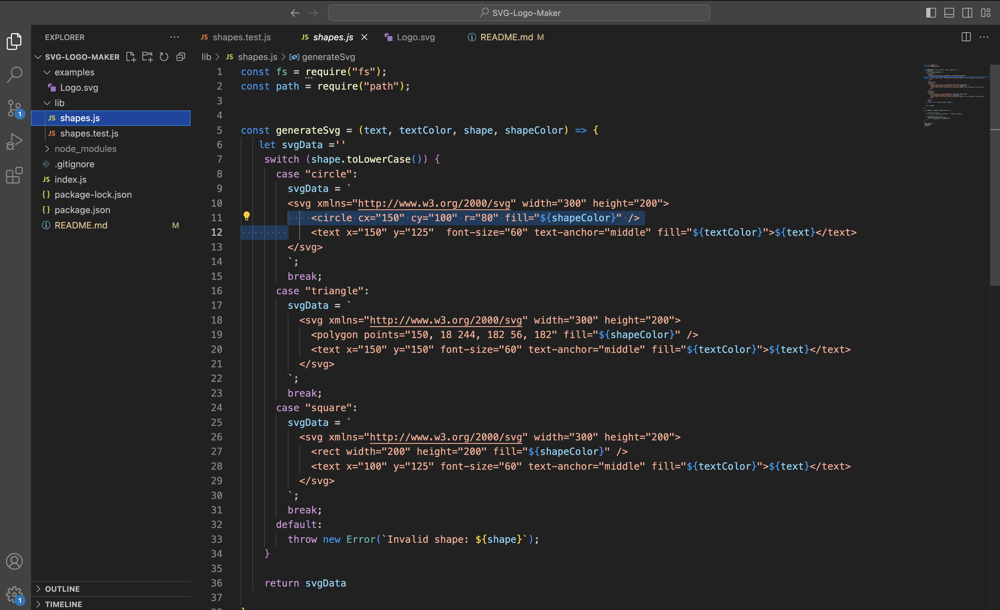
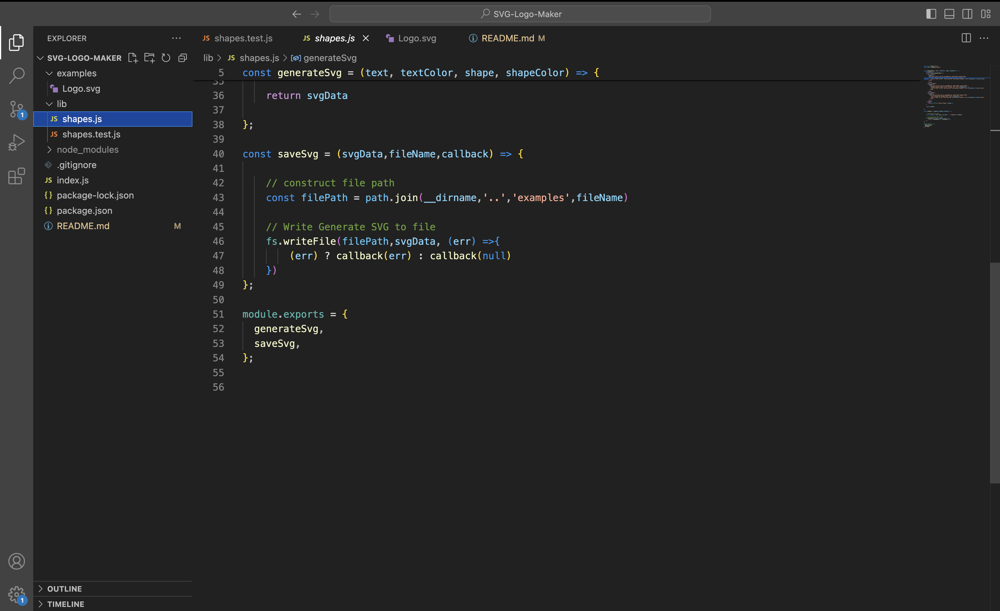
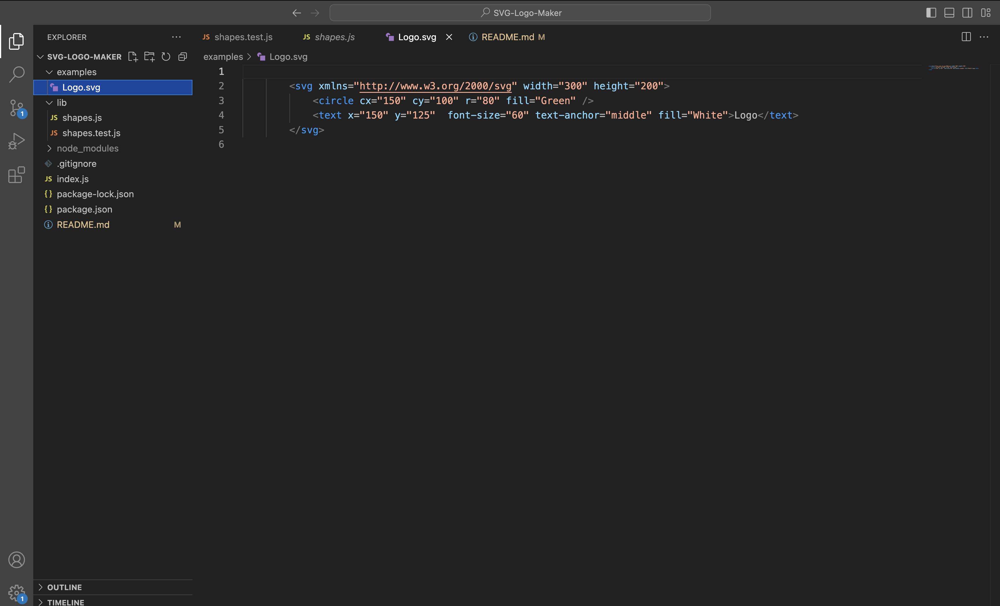
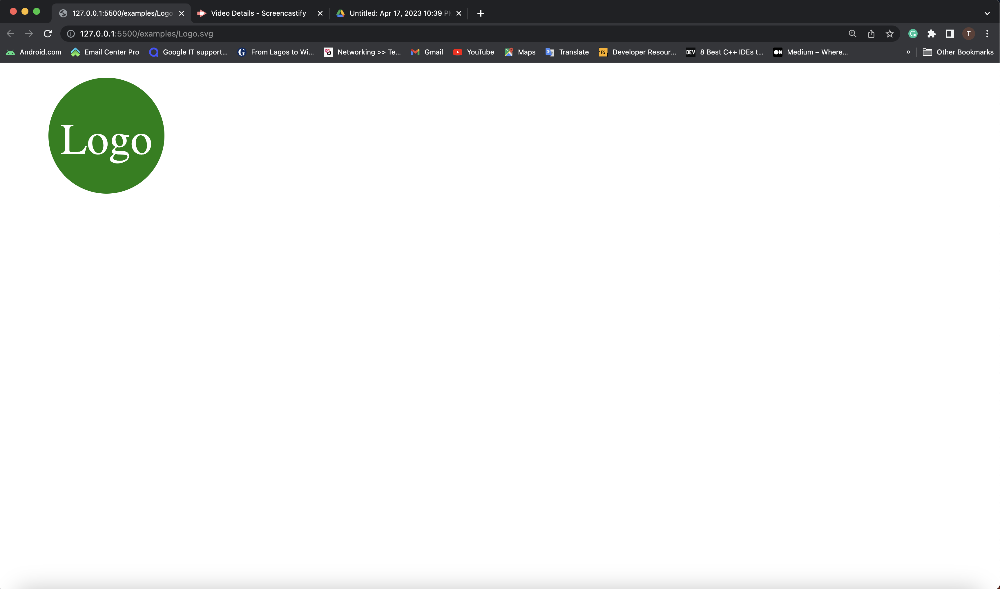

# SVG-Logo-Maker

# Project Name - SVG-Logo-Maker

# Project URL

https://github.com/TessyJ/SVG-Logo-Maker

# Project Repository

https://tessyj.github.io/SVG-Logo-Maker/

# Project Description

A generated logo application activates the user to select a colour and shape, provide text for the logo, and save the generated SVG to a `.svg` file.
The Application accepts user input, text or colour a hexadecimal number, and an SVG file is created, named `logo.svg`

# The walkthrough video link

https://drive.google.com/file/d/1xcBlaIXv3e1oCdIl8OMxBRc6BFnf-hZE/view

# Screen Shot

